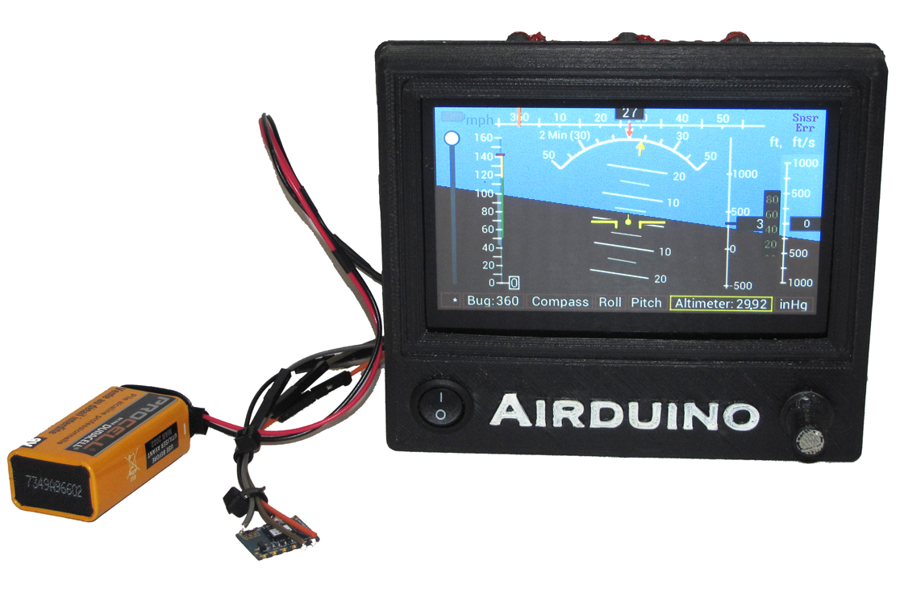

# Airduino
The Airduino is an Arduino Mega Based Experimental Aircraft Primary Flight Display.  For more information on the project, a materials list, and documentation on hardware, please visit www.theopencockpit.org.  You may download the Arduino software here on Github.  Currently, the machine is ported on a NewHaven 4.3 inch sunlight viewable screen.  Using a standard Airduino Mega, the unit generates about 16 frames per second.  This project is still very much in the beta phase, and we are not aware of anyone who is actually flying with one.  Don Morris (the project originator) is hoping to fly with one in an RV-4 later on this summer.
## Getting Started
I recommend that you begin with the manual, which is here in the root directory.  It is in docx format, at least for the time being.  Build the unit first, then come here for the software.
### Prerequisites
You will need a copy of Arduino installed on your computer.  The initial commit was written in version 1.8.5, but it should be compatible with any reasonably modern version.  This relies heavily on libraries provided from Adafruit (the generic sensor library and the BMB-280 library), from Newhaven, and from Yost Labs.  These files will provided here on Github. 
### Configuring the software for your use 
As is common on projects like this, a number of define statements are included at the beginning of the sotware.  These define statements are documented in the comments and in the manual.  These are used to configure the unit to default to English or Metric Units, to define the color bands of the airspeed indicator, to set appropriate speed ranges for your aircrat, and to determine display options.  Some of these parameters can be modified in flight.  Others can only be set at through the define statements in the software, and must them be uploaded to the Airduino before they take effect.  Spend your time on this section.
### Installing the software
Plug in the unit to a USB port, compile, and upload the code to you Arduino as per standard Arduino procedure.  Make sure that you have set the board type and port to the appropriate settings first.
## Versioning
The initial commit is intended to be for Beta purposes only.  It is not my intention that anyone fly with this version unless they have fully alternate instrumentation.  Versioning will be established as the project progresses.
## Contributing
There are a number of incomplete portions of code that can be worked on.  Additionally, this code coul be ported to a number of other processors and screen resolutions.  Much of the code could be tightened up to produce better performance.  There are a great number of other processors and sensors that can be tried without a large amount of recoding.  Anyone that is knowledgeable in aircraft and in coding is welcome to contribute.  Please contact me for details.
## Authors
The Airdunio was created by Don Morris with assistance from Chongwen Chen.  It is our hope that we will be abke to add more authors to this section in the future.
## Acknowledgments
This work is built upon the work of many others.  This is a call out to the unsung heros who slog away in dimly lit offices generating code to improve very non-glamorous open source projects.  Your work in the Arduino community, the Rep-Rap community, and the electronics community is truely inspiring, and allows people like me to come up with fun application projects.  Thank you.
